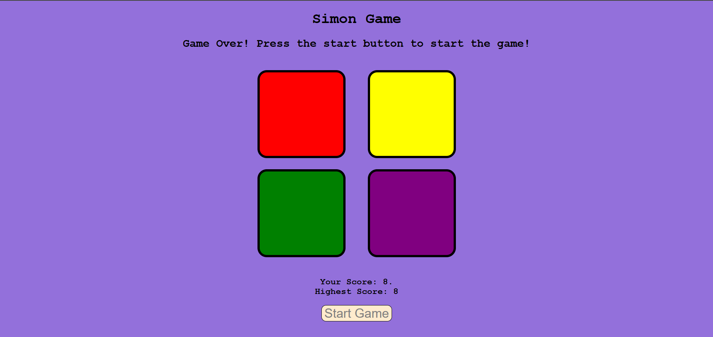

# 🎮 Simon Game

The **Simon Game** is a classic memory challenge where players must remember and repeat an increasing sequence of colors. With a **colorful UI, sound effects, and a score tracking system**, this game offers a fun and engaging experience! 🚀  

---

## 📌 Features  
✅ **Colorful UI** – Smooth animations and vibrant colors  
✅ **Unique Sound Effects** – Each button plays a distinct sound  
✅ **Progressive Difficulty** – The sequence grows longer each round  
✅ **Score Display** – Shows both **current score** and **high score**  
✅ **Responsive Design** – Playable on desktop and mobile devices  

---

## 🎲 How to Play  
1️⃣ **Start the Game** – Press any key to begin.  
2️⃣ **Watch and Remember** – A color button will flash.  
3️⃣ **Repeat the Sequence** – Click the buttons in the same order.  
4️⃣ **Level Up!** – Each correct round adds a new step to the sequence.  
5️⃣ **Game Over on Mistake** – The sequence resets, but your high score remains!  

---

## 🖥️ Tech Stack  
🔹 **HTML** – Game structure  
🔹 **CSS** – Styling and animations  
🔹 **JavaScript** – Game logic and interactivity  

---

## 🖼️ Game Preview  



---

## 📦 Installation & Setup  
1️⃣ **Clone this repository**  
```bash
git clone https://github.com/yourusername/Simon.git
```
2️⃣ **Navigate to the project folder**
```bash
cd simon-game
```
3️⃣ **Run the game**

Open index.html in your browser and start playing! 🎮

# 🚀 Future Enhancements  
- 🔹 **Enhanced UI** – Better visuals and smooth animations  
- 🔹 **User Profiles** – Players can enter their name and track scores  
- 🔹 **Multiplayer Mode** – Compete with friends in real-time  

## 🤝 Contributing  
Want to improve the game? **Fork this repo, make changes, and submit a pull request!**  

---

Enjoy the game and challenge yourself to beat the highest score! 🎮🔥  
